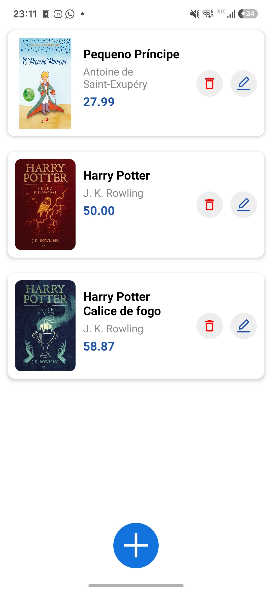
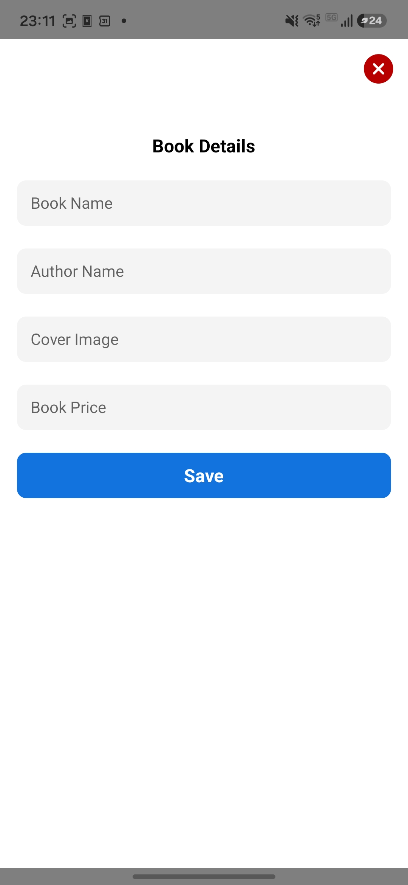
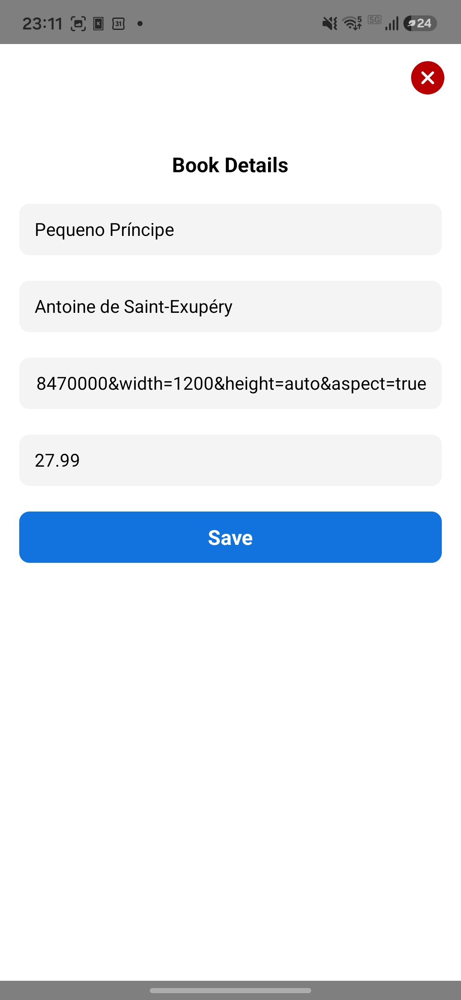
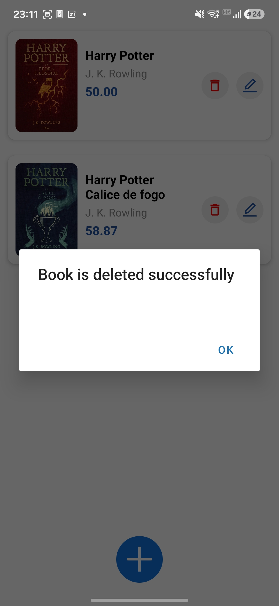
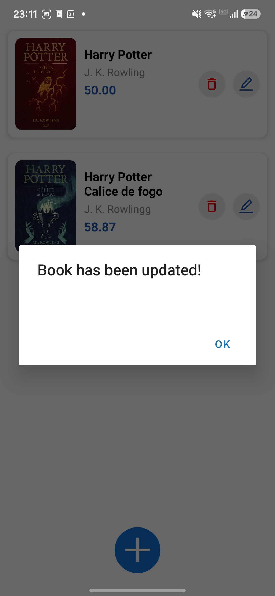

# 📚 Book Store App

Um aplicativo mobile moderno para gerenciar uma livraria digital. Crie, edite, visualize e delete livros de forma intuitiva e prática.

---

## 🎯 Funcionalidades

✨ **Funcionalidades principais:**

- **📖 Visualizar Livros** - Veja todos os livros disponíveis em um formato visual e organizado
- **➕ Adicionar Livros** - Crie novos registros de livros com informações completas
- **✏️ Editar Livros** - Modifique os detalhes de livros existentes
- **🗑️ Deletar Livros** - Remova livros do catálogo instantaneamente
- **🖼️ Capa do Livro** - Visualize capas em alta qualidade para cada livro
- **💰 Preço** - Consulte informações de preço de forma clara

### Tela Principal - Home


---

## 🛠️ Tecnologias Utilizadas

| Tecnologia | Versão | Propósito |
|----------|--------|----------|
| **React Native** | 0.85.3 | Framework para desenvolvimento mobile |
| **Expo** | ~56.0.8 | Plataforma para build e deploy |
| **TypeScript** | ~6.0.3 | Tipagem estática em JavaScript |
| **Axios** | ^1.17.0 | Cliente HTTP para chamadas de API |
| **Expo Vector Icons** | ^15.0.2 | Ícones elegantes e responsivos |

---

## 📋 Requisitos

Antes de começar, certifique-se de ter instalado:

- **Node.js** (v16 ou superior)
- **npm** ou **yarn**
- **Expo CLI** (instalável via `npm install -g expo-cli`)

---

## 🚀 Como Instalar e Executar

### 1. Clone o Repositório
```bash
git clone https://github.com/caioocardoso/book-store-app.git
cd book-store-app
```

### 2. Instale as Dependências
```bash
npm install
```

### 3. Inicie o Servidor de Desenvolvimento
```bash
npm start
```

### 4. Escolha a Plataforma

**Para Android:**
```bash
npm run android
```

**Para iOS:**
```bash
npm run ios
```

**Para Web:**
```bash
npm run web
```

---

## 📁 Estrutura do Projeto

```
book-store-app/
├── src/
│   ├── components/          # Componentes reutilizáveis
│   │   ├── BookCard.tsx       # Cartão de exibição do livro
│   │   ├── AddButton.tsx       # Botão flutuante para adicionar
│   │   ├── AppButton.tsx       # Botão padrão customizado
│   │   └── AppTextInput.tsx    # Campo de entrada customizado
│   ├── config/
│   │   └── config.ts          # Configurações de API e funções
│   ├── screens/
│   │   ├── HomeScreen.tsx      # Tela principal (lista de livros)
│   │   └── AddBookScreen.tsx   # Tela de adicionar/editar livro
│   └── assets/
├── assets/                  # Ícones e imagens
├── App.tsx                  # Componente raiz
├── app.json                 # Configurações do Expo
├── package.json             # Dependências e scripts
└── tsconfig.json            # Configuração do TypeScript
```

---

## 🧩 Componentes Principais

### **BookCard** 📇
Exibe informações de um livro em formato de cartão:
- Capa do livro (imagem)
- Título
- Autor
- Preço
- Botões de editar e deletar

### **HomeScreen** 🏠
Tela principal que:
- Lista todos os livros em uma FlatList
- Abre modal para adicionar/editar livros
- Gerencia o estado da lista
- Permite deletar livros

### **AddBookScreen** ➕
Modal para adicionar ou editar livros com campos para:
- Nome do livro
- Nome do autor
- URL da capa
- Preço

#### Adicionar Novo Livro


#### Editar Livro Existente


### **Componentes de UI** 🎨
- **AppButton** - Botão padrão com estilo consistente
- **AppTextInput** - Campo de entrada customizado
- **AddButton** - Botão flutuante para criar novos livros

---

## 🔌 API e Configuração

O aplicativo se conecta a uma **MockAPI** para gerenciar os dados:

```
Endpoint: https://6a1ef04ab79eec0d6cf05198.mockapi.io/books
```

### Operações Disponíveis

#### **Listar Livros**
```typescript
getListOfBooks({ onSuccess, onFailure })
```

#### **Obter Livro por ID**
```typescript
getBookById({ onSuccess, onFailure })
```

#### **Criar Livro**
```typescript
createBook({
  body: {
    title: string,
    name_of_author: string,
    cover: string,
    price: string
  },
  onSuccess,
  onError
})
```

#### **Atualizar Livro**
```typescript
updateBook({
  id: string,
  body: { ...livro },
  onSuccess,
  onError
})
```

#### **Deletar Livro**
```typescript
deleteBookById({
  itemID: string,
  onSuccess,
  onFailure
})
```

---

## 📸 Capturas de Tela

### Confirmação de Operações

#### ✅ Livro Deletado com Sucesso


#### ✅ Livro Atualizado com Sucesso


---

## 🎨 Design e UI

O aplicativo utiliza uma **paleta de cores moderna**:

- **Azul Primário**: `#1273DE` - Botões e destaques
- **Vermelho**: `#B80000` - Ícone de delete
- **Azul Escuro**: `#25a` - Ícone de edit
- **Cinza Claro**: `#f4f4f4` - Campos de entrada

---

## 💡 Como Usar

### 1. **Visualizar Livros**
Ao abrir o app, você verá uma lista com todos os livros cadastrados.

### 2. **Adicionar um Novo Livro**
- Clique no botão **azul com "+"** na parte inferior
- Preencha os campos (nome, autor, capa e preço)
- Clique em **"Save"**

### 3. **Editar um Livro**
- Clique no ícone **editar** no cartão do livro
- Modifique as informações desejadas
- Clique em **"Save"**

### 4. **Deletar um Livro**
- Clique no ícone **delete** no cartão do livro
- Confirme a ação

---

## 📱 Compatibilidade

- ✅ **Android** - Totalmente suportado
- ✅ **iOS** - Totalmente suportado
- ✅ **Web** - Suportado via Expo Web

---

## 🔄 Fluxo da Aplicação

```
App.tsx
  ↓
HomeScreen (Tela Principal)
  ├─ Carrega lista de livros
  ├─ Exibe BookCards
  ├─ Modal com AddBookScreen (ao clicar em +)
  └─ Gerencia CRUD
```

---

## 📝 Estrutura de Dados do Livro

```typescript
{
  id: string;
  title: string;              // Nome do livro
  name_of_author: string;     // Nome do autor
  cover: string;              // URL da capa (imagem)
  price: string;              // Preço do livro
}
```

---

## 🚨 Tratamento de Erros

O aplicativo trata erros de forma amigável:
- **Erros de criação/edição**: Exibe um Alert
- **Erros de API**: Logged no console
- **Erros de deleção**: Exibe mensagem de sucesso ou erro

---

## 📚 Recursos Adicionais

- **Documentação Expo**: https://docs.expo.dev/
- **React Native Docs**: https://reactnative.dev/
- **MockAPI**: https://mockapi.io/

---

## 🎓 Créditos

Este projeto foi desenvolvido em conjunto durante o curso:

**[React Native 2026: The Complete Modern Course](https://www.udemy.com/course/react-native-2024-the-complete-native-app-development/)** 
📚 Instrutor: **Ahmed Sawy**

O curso aborda desde conceitos fundamentais até técnicas avançadas de desenvolvimento mobile com React Native, Expo, TypeScript e integração com APIs.

---

**Aproveite e organize sua livraria! 📚✨**
